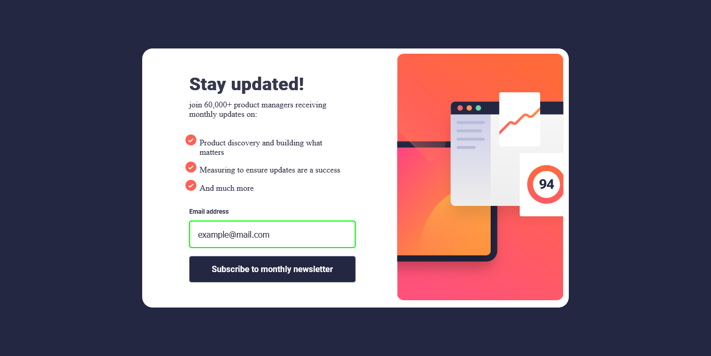

# Frontend Mentor - Newsletter sign-up form with success message solution

This is a solution to the Newsletter sign-up form with success message challenge on Frontend Mentor

## Table of contents

- [Overview](#overview)
  - [The challenge](#the-challenge)
  - [Screenshot](#screenshot)
  - [Links](#links)
- [My process](#my-process)
  - [Built with](#built-with)
- [Author](#author)

## Overview

### The challenge

Users should be able to:

- Add their email and submit the form
- See a success message with their email after successfully submitting the form
- See form validation messages if:
  - The field is left empty
  - The email address is not formatted correctly
- View the optimal layout for the interface depending on their device's screen size
- See hover and focus states for all interactive elements on the page

### Screenshot

### Links

- Live Site URL: [live site URL](https://kindnesskay.github.io/newsletter-letter-signup/)

## My process

### Built with

- Semantic HTML5 markup
- CSS custom properties
- Flexbox
